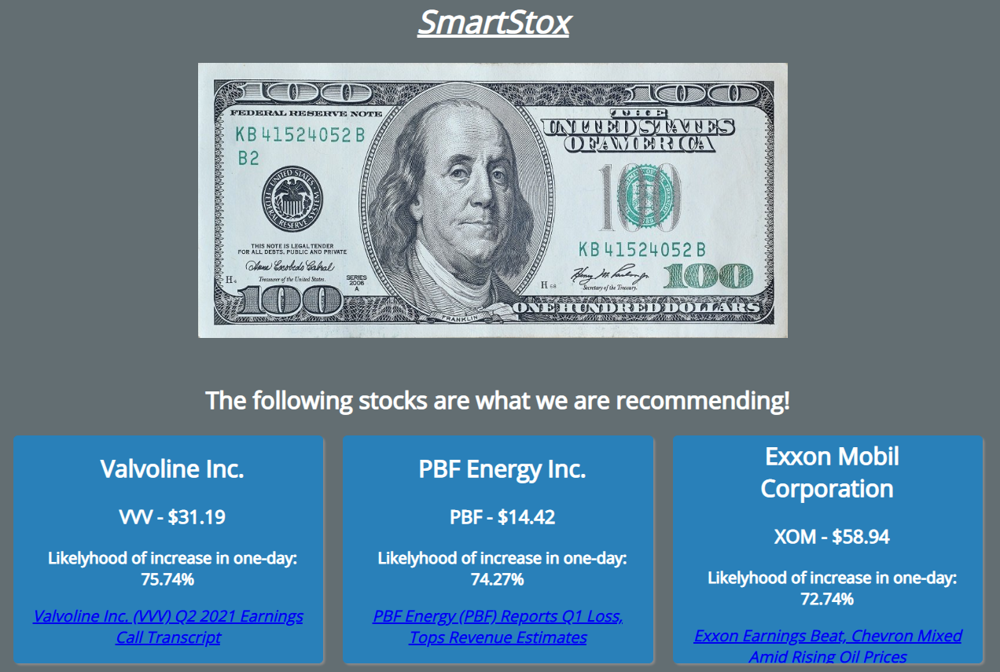
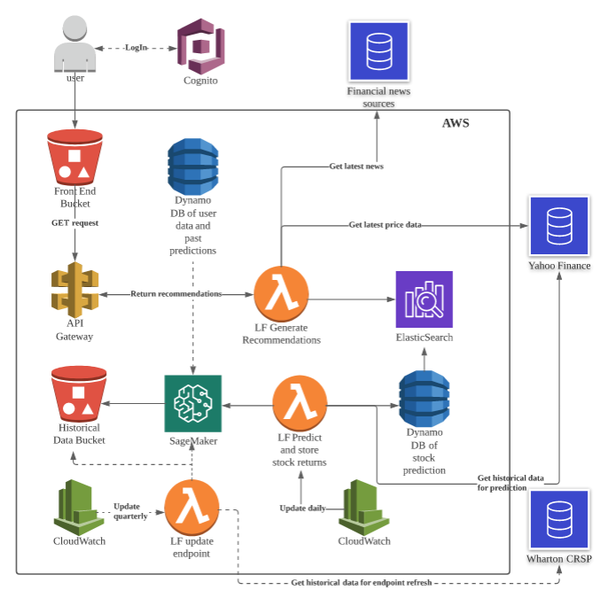

Jiaxuan Pan (jp4131)

Chengyan Gu (cg3114)

Chris Charron (cc4399)

**SmartStox**

Demo Video: 
[[https://youtu.be/yREsQbxZ1BM]{.ul}](https://youtu.be/yREsQbxZ1BM)


**Introduction**

People looking for investments nowadays are constantly bombarded by a
barrage of opinions on how certain stocks are likely to behave in the
future, or how the market in general is expected to trend. These
opinions are often at odds with one another, leaving the casual investor
understandably confused about where to place their money. We propose to
help such people out with a simple, user-friendly stock recommendation
application.

There are a number of metrics that can be used to assess any one stock's
strengths and weaknesses, and by extension its likelihood of faring well
or poorly in the future. Before even exploring these metrics, we would
like to get a more comprehensive profile of our user, by understanding
their:

-   Income

-   Age

-   Favored industries

-   Risk profile (Risk averse vs. risk loving, etc)

We solicit this information from the user either through direct prompts
when they log into the app. The purpose of asking these questions is
two-fold. First, we would like to assess an acceptable risk-return
profile for the investor, which will depend on their age and tolerance
for risk. Second, as we are assuming our users are not very
investment-savvy, we want to ensure that our proposed investments are in
companies or industries that they recognize. We expect this will
increase the appeal of the app.

The backend has two main jobs: collecting and processing financial data
to train our recommendation engine, and then returning recommendations
based on the user's profile. We use Wharton Research Data Services to
source data on the US stock market and company financials (earnings,
etc) to train our model, and then we use Yahoo Finance info to generate
the latest price information on stocks we recommend, and also scrape the
web for the latest news sources.

Our output to the user consists of a set of up to 3 stocks for
investment, along with information such as the latest price, latest
news, and our model's predicted probability of price increase in the
user's selected timeframe.

**Front end**

The front end asks the users a series of 7 questions to understand more
about them, their risk preference, etc. Then, the front end outputs the
3 most recommended stocks for that particular user. Some screenshots of
the process are shown below:




Note that we did create a prototype at the link below, but our final app
design ended up being different:

[[https://projects.invisionapp.com/prototype/ckkx9erhp00bs1u01rsk97xi3/play]{.ul}](https://projects.invisionapp.com/prototype/ckkx9erhp00bs1u01rsk97xi3/play)

**Architecture**



Here's a quick overview of how the app works:

-   Historical stock data is procured from Wharton CRSP and stored in
    > S3. This is used to train our sagemaker endpoints (We have
    > different endpoints for different time horizons. More on how the
    > models work in the next section). We re-train the model every
    > quarter with the latest stock price data

-   Every day, we run a lambda function that runs all active stocks
    > through each of our model endpoints to get a prediction on the
    > likelihood of that stock increasing for the particular time
    > horizon (e.g. running MSFT through our 1-day endpoint will give us
    > a prediction for the likelihood that MSFT stock will increase in
    > the next 1 trading day). The prediction results for all stocks are
    > stored in DynamoDB and in Elastic Search for quick retrieval

-   End users access the app through the front-end stored in S3. The
    > front end makes an API GET call to the /recommend endpoint which
    > includes the background information provided by the user (age/risk
    > tolerance/etc). A lambda function uses this information to filter
    > the information in ElasticSearch and return the stocks with the
    > highest predicted values. Further information such as latest price
    > data and most recent news is also returned to the end user

**SageMaker Models used to generate recommendations**

In this project, XGBoost model is used to predict the direction of stock
price change. The predicted probability of future price increase is used
as the signal to make the stock recommendations.

**\[Target Variable\]** In detail, a binary dummy is created as the
target variable to indicate whether there is a price increase over the
time horizon X (i.e., it equals to 1 if a price increase is observed and
otherwise 0). Here, the time horizon X can be 1-day, 5-day, 10-day,
20-day, etc. In practice, modeling price change direction is one
component of the widely used decomposition model (which typically
decomposes and models the stock price change into three components: an
indicator of price change, the direction of price movement, and the size
of price change) (Tsay, 2010; Prado, 2018). The predicted probability of
future price increase can be used as the entry signal should the
investor want to hold the equity over the time horizon X.

**\[Stock Price Data\]** This project uses the Center for Research in
Security Prices (CRSP) daily stock price data from the Wharton Research
Data Services (WRDs) for modeling purposes. Comparing with other data
sources, CRSP is free and maintains the most comprehensive collection of
security price, return, and volume data for the NYSE, AMEX and NASDAQ
stock markets, which can trace back to 1962. It also covers stock events
(e.g., merger, dividend, and exit dates), stock characteristics (e.g.,
SIC Codes/Standard Industrial Classification Codes) and stock indices
data. For simplicity, this project uses the daily price data of all
stocks in three major US stock exchanges (NYSE, AMEX and NASDAQ) as the
modeling population. The data of 2016-2019 are took as the in-time
training sample and the 2020 data are treated as the out-of-time sample.

**\[User Preference Data\]** Ideally, users' preference data can be
combined with stock price data to generate some personalized
recommendations. However, unlike many other applications such as Netflix
and TikTok in which users have some persistent preferences, in the
financial world, there is no publicly available user finance preference
data, and users' preferences are dynamic as the market conditions change
rapidly. As a result, this project only takes two input data from the
users (i.e., industry and expected holding period) to make the
recommendations. Other user information like risk preference, age,
income, and review history will be recorded and saved in one DynamoDB
and left for future model enhancements (through collaborative filtering
or neutral network models).

**\[Feature Engineering\]** The CRSP data covers five basic daily price
features widely used in practice: adjusted high, adjusted low, adjusted
open, adjust close and volume. Two types of feature engineering
techniques are used to capture market shocks and firm-specific abnormal
returns.

*Beta Factors*: To measure how stock returns co-move with the market
indices (e.g., a stock's price might increase or decrease following the
S&P 500 index or market-level good or bad news), daily Fama-French five
factors (Davis, 2001; Fama and French, 1993, 2015) are pulled directly
using the Yahoo Finance API. These factors can help capture excess
market return, market-level or industry-level asymmetricities in firm
size, value, profitability and investment would affect each stock's
daily return.

*Alpha Factors*: To measure stock-level abnormal returns (e.g., Tesla's
price jumps due to one good news), several alpha factors are created
based upon CRSP's stock daily closing prices (Schwert, 2003). For
example, daily return is calculated as the dollar change in a stock\'s
price as a percentage of the previous day\'s closing price, and its lags
(e.g., 1-day lag, 2-day lag, and 3-day lag) are used to capture the
price trend. As one momentum (e.g., one good news) can last for several
days, momentum factors are created to capture the tendency of winning
stocks to continue performing well in the near term. For example, the
difference between recent 5-day return and 10-day return can be used in
the model to capture how firm's last week performance affect stock's
current return. Bollinger bands series measure a stock price's dynamic
standard deviation boundaries (i.e., if a stock price is above its 2
standard deviations of its recent moving average, it can be a buy/sell
signal combining with other signals). The relative strength index (RSI)
is a momentum indicator used in technical analysis that measures the
magnitude of recent price changes to evaluate overbought or oversold
conditions in the price of a stock or other asset.

**\[XGBoost Model\]** Given the target binary variable and additional
price feature, XGBoost models are built for each expected holding period
(e.g., one GBT model for 1-day return \> 0 and another one for 20-day
return \> 0).

Gradient boosting is a technique for regression and classification
problems which produce a prediction model in the form of an ensemble of
weak predictors (e.g., a decision tree model). Like other boosting
methods, it combines weak learners into a single learner but in an
iterative fashion: It starts fitting by learning an imperfect model T(x)
(i.e., decision tree to minimize the mean squared errors or maximize the
Gini index) and calculate the residual y - T(x). Then another weak
learner is built to fit such residual and this process keeps running for
M stages. In detail, its estimation process is shown as follows:

**GBT Algorithm**

+----------------------------------------------------------------------+
| 1.  Initialize a weak learner to optimize the objective function     |
|     > (MSE or Gini)                                                  |
|                                                                      |
| 2.  For *m* = 1 to M:                                                |
|                                                                      |
| ```{=html}                                                           |
| <!-- -->                                                             |
| ```                                                                  |
| 1)  Compute the updated residual;                                    |
|                                                                      |
| 2)  Fit a learner (tree) $t_{m}(x)$ to the residual;                 |
|                                                                      |
| 3)  Compute the multiplier *r~m~* by solving the following           |
|     optimization problem:                                            |
|                                                                      |
| $$r_{m} = \ \text{argmin}_{r}\sum_{i = 1}^{n}{L(                     |
| y_{i},\ \text{\ T}_{m - 1}\left( x_{i} \right) + r\ t_{m}(x_{i}))}$$ |
|                                                                      |
| 4)  Update the model:                                                |
|     $\text{\ T}_{m}\left( x_{i} \right)                              |
|  = \ \text{\ T}_{m - 1}\left( x_{i} \right) + \ r_{m}\ t_{m}(x_{i})$ |
|                                                                      |
| ```{=html}                                                           |
| <!-- -->                                                             |
| ```                                                                  |
| 3.  Output $\text{\ T}_{M}(x)$                                       |
+----------------------------------------------------------------------+

Here, the multiplier *r~m~* can be viewed as a relative weight to append
an additional weak learner. XGBoost model follows the same principle of
gradient boosting. In addition, it uses a regularized model
specification to control over-fitting (as well as some memory
utilization techniques), which often gives it better performance.

**\[Model Performance and Implementation\]** The models are trained used
the SageMaker's embedded XGBoost container and hyperparameters are
finetuned before deploying into endpoints. Given the limited amount of
time and feature engineering work, while building a well performed and
profitable model is beyond the scope of this project, our models exhibit
some reasonable performances. Their ROCs (Receiver Operating
Characteristic) are around 60, which are larger than a random selection
(which ROC = 50). Further backtesting and model refinements are needed
before throwing any money into it. Careful designs of models and
strategies are keys to operate a successful fund, which is also beyond
the scope of this project.

The XGBoost models are trained for each expected holding period (e.g.,
one GBT model for 1-day return \> 0 and another one for 20-day return \>
0). As described above, two user inputs are utilized during the
implementation stage. The user has to specify (1) the interested
industry and (2) the expected holding period. From the front end, the
lambda function takes user selected industry and extracts all relevant
stocks' (in that industry) latest price information. When a specific
holding period is triggered by the user, the relevant model's endpoint
will be invoked accordingly to get the predicted probabilities of price
increase for all stocks in that industry. Finally, the lambda function
will return/recommend top 3 stocks based upon those predicted
probabilities.

**References**

Davis, J.L. 2001. "Explaining Stock Returns: A Literature Survey,"
Dimensional Fund Advisors.

Fama, E. and French, K. 1993. "Common Risk Factors in the Returns on
Stocks and Bonds," The *Journal of Financial Economics*, 33, 3-56.

Fama, E. and French, K. 2015. "A Five-Factor Asset Pricing Model," The
*Journal of Financial Economics*, 116, 1-22.

Prado, M.L. 2018. *Advances in Financial Machine Learning*. John Wiley &
Sons, Hoboken, NJ.

Rasekhschaffe, K.C. and Jones, R.C. 2019. "Machine Learning for Stock
Selection," *Financial Analysts Journal*, Q3, 70-88.

Schwert, W.G. 2003. "Anomalies and Market Efficiency," in *Handbook of
the Economics of Finance*, ed. By Constantinides, G.M., Harris, M., and
Stulz, R. North Holland, New York, NY.

Sezer, O.B., Gudelek, M.G. and Ozbayoglu, M. 2020. "Financial Time
Series Forecasting with Deep Learning: A Systematic Literature Review:
2005-2019," *Applied Soft Computing Journal*, 90, 1-32.

Tsay, R.S. 2010. *Analysis of Financial Time Series*. John Wiley & Sons,
Hoboken, NJ.
